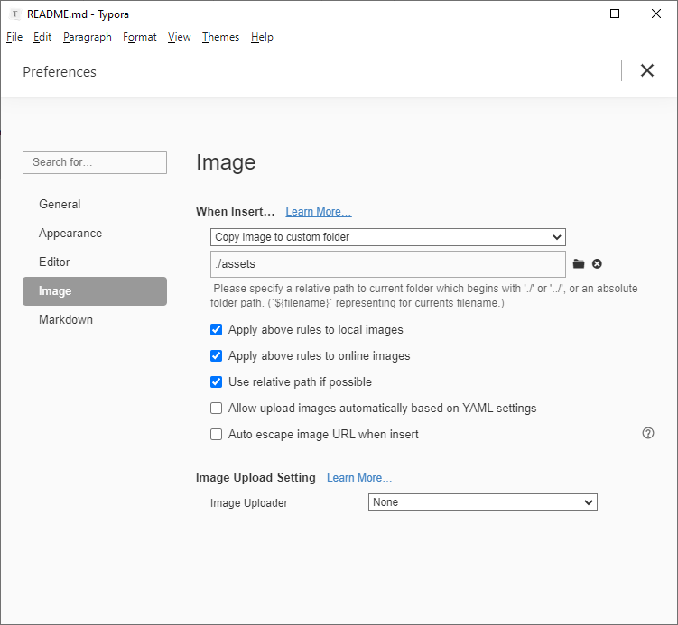

# latexMarkdown2Markdown in Java 11
**Table of content**

[1.1 About](#11-about)  
[1.2 Usage](#12-usage)  
  
  
[2 Technical notes](#2-technical-notes)  
[2.1 Files.Walk() alternative](#21-fileswalk-alternative)  
[2.2 Dependencies](#22-dependencies)  
  
  
[3 Use Typora](#3-use-typora)  
[3.1 How to configure](#31-how-to-configure)  
[3.1.1 Css template for chapter numbering](#311-css-template-for-chapter-numbering)  
[3.1.2 Typical usage](#312-typical-usage)  


## 1.1 About

This little tool produces a nice **README.md** for your Github repository given a **README.tex.md**

- All LaTex sections are converted to SVG an placed in an `./asset` folder.
- Optionally a table of content can be added, with chapter numbering.

## 1.2 Usage

```
    >java -jar latexMarkdown2Markdown-1.0-SNAPSHOT.jar
    
    The following option is required: [-dir]
    Usage: <main class> [options]
      Options:
        -background
          Force the background color in hexa #rrggbb instead of a transparent
          background
    
      * -dir
        directory where *.tex.md files are
        -toc
          generate a table of content and add numbers to chapters
          Default: false
```

​    

# 2 Technical notes

## 2.1 Files.Walk() alternative

```java
/**
 * 
 * Files.walk() is mostly unusable. Here is a better version, single threaded and
 * lazy evaluated. In this implementation elements are ordered (files first).
 * 
 * see:
 * https://stackoverflow.com/questions/22867286/files-walk-calculate-total-size/22868706
 * 
 * Note: there is no way to avoid the filter in the constructor if you plan to
 * use lazy evaluation. this is due to the way Stream.iterate() is made.
 * 
 */
public class FilesWalker {
	private static Logger logger = Logger.getLogger(FilesWalker.class.getName());

	private static class HiddenState {

		private Stack<File> stack = new Stack<File>();

		private Predicate<File> filter;

		public HiddenState(Predicate<File> filter) {
			this.filter = filter;
		}

		public boolean hasNext(File current) {

			try {
				if (current.isDirectory()) {
					File[] children = current.listFiles();
					//
					// visit the file first, then the folders
					//
					Arrays.sort(children, (f1, f2) -> {
						Boolean b1 = f1.isDirectory();
						Boolean b2 = f2.isDirectory();
						int cmp = b2.compareTo(b1);
						return cmp == 0 ? f2.getName()
								.compareTo(f1.getName()) : cmp;
					});

					Arrays.stream(children)
							.filter(filter)
							.forEach(f -> stack.push(f));
				}
			} catch (Exception e) {
				logger.log(Level.WARNING, "Unexpected error on folder " + current.getAbsolutePath(), e);
			}

			return !stack.isEmpty();
		}

		public File nextOf(File current) {
			return stack.pop();
		}

	}

	public static Stream<File> walk(Path folder, Predicate<File> filter) {
		// We have an HiddenState for every call, so it is threadsafe.
		HiddenState stat = new HiddenState(filter);
		return Stream.iterate(folder.toFile(), stat::hasNext, stat::nextOf);
	}
}
```

## 2.2 Dependencies

This tool use [Apache Batik](https://xmlgraphics.apache.org/batik/) to generate an SVG file. The SVG content generated from LaTex is performed by [jlatexmath](https://github.com/opencollab/jlatexmath).

All of this in embeded in the final fat jar.

# 3 Use Typora

Typora is a wonderful markdown WYSIWYG editor supporting LaTex sections.

## 3.1 How to configure

Go in the settings and use the folder `./assets` to store images.



Now every time you past an image into Typora, it will go directly to the **asset** folder.

### 3.1.1 Css template for chapter numbering

Here is how to enable chapter numbering:

Create **C:\Users\admin\AppData\Roaming\Typora\themes\base.user.css** with the following:

```css
h1,h2,h3,h4,h5 {
 font-family: 'Sitka'; 
}

/**************************************
 * Header Counters in Outline
 **************************************/

.sidebar-content {
    counter-reset: h1
}

.outline-h1 {
    counter-reset: h2
}

.outline-h2 {
    counter-reset: h3
}

.outline-h3 {
    counter-reset: h4
}

.outline-h4 {
    counter-reset: h5
}

.outline-h5 {
    counter-reset: h6
}

.outline-h1>.outline-item>.outline-label:before {
    counter-increment: h1;
    content: counter(h1) ". "
}

.outline-h2>.outline-item>.outline-label:before {
    counter-increment: h2;
    content: counter(h1) "." counter(h2) ". "
}

.outline-h3>.outline-item>.outline-label:before {
    counter-increment: h3;
    content: counter(h1) "." counter(h2) "." counter(h3) ". "
}

.outline-h4>.outline-item>.outline-label:before {
    counter-increment: h4;
    content: counter(h1) "." counter(h2) "." counter(h3) "." counter(h4) ". "
}

.outline-h5>.outline-item>.outline-label:before {
    counter-increment: h5;
    content: counter(h1) "." counter(h2) "." counter(h3) "." counter(h4) "." counter(h5) ". "
}

.outline-h6>.outline-item>.outline-label:before {
    counter-increment: h6;
    content: counter(h1) "." counter(h2) "." counter(h3) "." counter(h4) "." counter(h5) "." counter(h6) ". "
}
/**************************************
 * Header Counters in TOC
 **************************************/

/* No link underlines in TOC */
.md-toc-inner {
    text-decoration: none;
}

.md-toc-content {
    counter-reset: h1toc
}

.md-toc-h1 {
    margin-left: 0;
    font-size: 1.5rem;
    counter-reset: h2toc
}

.md-toc-h2 {
    font-size: 1.1rem;
    margin-left: 2rem;
    counter-reset: h3toc
}

.md-toc-h3 {
    margin-left: 3rem;
    font-size: .9rem;
    counter-reset: h4toc
}

.md-toc-h4 {
    margin-left: 4rem;
    font-size: .85rem;
    counter-reset: h5toc
}

.md-toc-h5 {
    margin-left: 5rem;
    font-size: .8rem;
    counter-reset: h6toc
}

.md-toc-h6 {
    margin-left: 6rem;
    font-size: .75rem;
}

.md-toc-h1:before {
    color: black;
    counter-increment: h1toc;
    content: counter(h1toc) ". "
}

.md-toc-h1 .md-toc-inner {
    margin-left: 0;
}

.md-toc-h2:before {
    color: black;
    counter-increment: h2toc;
    content: counter(h1toc) ". " counter(h2toc) ". "
}

.md-toc-h2 .md-toc-inner {
    margin-left: 0;
}

.md-toc-h3:before {
    color: black;
    counter-increment: h3toc;
    content: counter(h1toc) ". " counter(h2toc) ". " counter(h3toc) ". "
}

.md-toc-h3 .md-toc-inner {
    margin-left: 0;
}

.md-toc-h4:before {
    color: black;
    counter-increment: h4toc;
    content: counter(h1toc) ". " counter(h2toc) ". " counter(h3toc) ". " counter(h4toc) ". "
}

.md-toc-h4 .md-toc-inner {
    margin-left: 0;
}

.md-toc-h5:before {
    color: black;
    counter-increment: h5toc;
    content: counter(h1toc) ". " counter(h2toc) ". " counter(h3toc) ". " counter(h4toc) ". " counter(h5toc) ". "
}

.md-toc-h5 .md-toc-inner {
    margin-left: 0;
}

.md-toc-h6:before {
    color: black;
    counter-increment: h6toc;
    content: counter(h1toc) ". " counter(h2toc) ". " counter(h3toc) ". " counter(h4toc) ". " counter(h5toc) ". " counter(h6toc) ". "
}

.md-toc-h6 .md-toc-inner {
    margin-left: 0;
}

/**************************************
 * Header Counters in Content
 **************************************/

/** initialize css counter */
#write {
    counter-reset: h1
}

h1 {
    counter-reset: h2
}

h2 {
    counter-reset: h3
}

h3 {
    counter-reset: h4
}

h4 {
    counter-reset: h5
}

h5 {
    counter-reset: h6
}

/** put counter result into headings */
#write h1:before {
    counter-increment: h1;
    content: counter(h1) ". "
}

#write h2:before {
    counter-increment: h2;
    content: counter(h1) "." counter(h2) ". "
}

#write h3:before, h3.md-focus.md-heading:before { /*override the default style for focused headings */
    counter-increment: h3;
    content: counter(h1) "." counter(h2) "." counter(h3) ". "
}

#write h4:before, h4.md-focus.md-heading:before {
    counter-increment: h4;
    content: counter(h1) "." counter(h2) "." counter(h3) "." counter(h4) ". "
}

#write h5:before, h5.md-focus.md-heading:before {
    counter-increment: h5;
    content: counter(h1) "." counter(h2) "." counter(h3) "." counter(h4) "." counter(h5) ". "
}

#write h6:before, h6.md-focus.md-heading:before {
    counter-increment: h6;
    content: counter(h1) "." counter(h2) "." counter(h3) "." counter(h4) "." counter(h5) "." counter(h6) ". "
}

/** override the default style for focused headings */
#write>h3.md-focus:before, #write>h4.md-focus:before, #write>h5.md-focus:before, #write>h6.md-focus:before, h3.md-focus:before, h4.md-focus:before, h5.md-focus:before, h6.md-focus:before {
    color: inherit;
    border: inherit;
    border-radius: inherit;
    position: inherit;
    left: initial;
    float: none;
    top: initial;
    font-size: inherit;
    padding-left: inherit;
    padding-right: inherit;
    vertical-align: inherit;
    font-weight: inherit;
    line-height: inherit;
}
```

### 3.1.2 Typical usage

You git clone in `C:/my-repo-folder`

Write `C:/my-repo-folder/README.tex.md` in Typora. LaTex sections are separated by `$$`.

Run **LatexMarkdown2Markdown** on the folder like this:

```
java -jar latexMarkdown2Markdown-1.0-SNAPSHOT.jar -dir C:/my-repo-folder -toc
```

It will generate ``C:/my-repo-folder/README.md` with a table of content and convert all LaTex in SVG images in the folder `C:/my-repo-folder/assets/`.

```
INFO:  Generate C:\my-repo-folder\README.md  
INFO:  latexMarkdown2Markdown in Java 11  
INFO:  1.1 About  
INFO:  1.2 Usage  
INFO:    
INFO:  2 Technical notes  
INFO:  2.1 Files.Walk() alternative  
INFO:  2.2 Dependencies  
INFO:    
INFO:  3 Use Typora  
INFO:  3.1 How to configure  
INFO:  3.1.1 Css template for chapter numbering  
INFO:  3.1.2 Typical usage  
```

You can now push the repo on GitHub.

